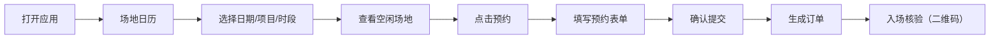

## 1. 产品概述

智慧体育场馆预约系统是面向学校体育馆的纯前端应用，为师生提供羽毛球、乒乓球和健身房时段的在线预约服务，同时为管理员提供场地管理、数据统计等功能。

- 核心价值：解决体育馆场地预约效率低、管理混乱的问题，提升师生使用体验和场馆运营效率
- 目标用户：学校师生（普通用户）、场馆管理员

## 2. 核心功能

### 2.1 用户角色

| 角色 | 登录方式 | 核心权限 |
|------|----------|----------|
| 普通用户（师生） | 模拟登录 | 浏览场地、提交预约、查看订单、生成入场码、查看公告 |
| 管理员 | 模拟登录 | 场地管理、公告发布、预约限制设置、数据统计、爽约标记 |

### 2.2 功能模块

1. **场地日历**：日历视图、日期/项目/时段筛选、场地状态展示（空闲/已订/维护/比赛）
2. **预约表单**：项目选择、时段选择、人数填写、联系人信息、价格/免费规则展示
3. **个人订单**：订单列表、订单详情、取消未开始订单
4. **入场核验**：入场二维码生成、预约信息展示
5. **公告规则**：场馆公告、预约规则、收费标准

### 2.3 页面详情

| 页面名称 | 模块名称 | 功能描述 |
|----------|----------|----------|
| 场地日历 | 顶部导航 | 五个视图切换、用户信息、角色切换 |
| 场地日历 | 筛选区域 | 日期选择、项目筛选（羽毛球/乒乓球/健身房）、时段筛选 |
| 场地日历 | 日历网格 | 按日期展示场地时段状态，颜色区分空闲/已订/维护/比赛 |
| 场地日历 | 图例说明 | 四种状态的颜色图例 |
| 预约表单 | 项目选择 | 羽毛球/乒乓球/健身房三个项目卡片选择 |
| 预约表单 | 时段选择 | 日期选择器 + 时间段列表 |
| 预约表单 | 信息填写 | 预约人数、联系人姓名、联系电话 |
| 预约表单 | 价格规则 | 显示价格或免费规则说明 |
| 预约表单 | 提交按钮 | 确认预约提交 |
| 个人订单 | 订单列表 | 按状态分类（待使用/已完成/已取消）、订单卡片 |
| 个人订单 | 订单详情 | 显示预约详情、场地信息、联系人信息 |
| 个人订单 | 取消操作 | 未开始订单可取消 |
| 入场核验 | 二维码展示 | 动态生成入场二维码 |
| 入场核验 | 预约信息 | 订单号、项目、时间、场地信息 |
| 入场核验 | 核验状态 | 待核验/已核验状态展示 |
| 公告规则 | 公告列表 | 场馆公告、赛事通知 |
| 公告规则 | 预约规则 | 预约须知、取消规则 |
| 公告规则 | 收费标准 | 各项目价格说明 |
| 管理员面板 | 场地管理 | 临时关闭场地、恢复场地 |
| 管理员面板 | 公告管理 | 发布公告、赛事占用公告 |
| 管理员面板 | 预约设置 | 每人每日预约上限设置 |
| 管理员面板 | 数据统计 | 到场率统计图表 |
| 管理员面板 | 爽约管理 | 标记爽约、查看爽约记录 |

## 3. 核心流程

### 3.1 用户预约流程

用户打开应用 → 进入场地日历 → 选择日期和项目 → 查看空闲时段 → 点击预约 → 填写预约信息 → 确认提交 → 生成订单 → 入场核验

### 3.2 管理员管理流程

管理员登录 → 进入管理面板 → 场地管理/公告管理/数据统计/预约设置 → 操作执行 → 保存生效

## 4. 用户界面设计

### 4.1 设计风格

- **主色调**：采用运动活力风格，以活力橙（#FF6B35）为主色，搭配深青色（#004E64）作为辅助色
- **中性色**：以 slate 色系为基础，保持界面清爽专业
- **按钮风格**：圆角矩形按钮，悬停时有微动画效果
- **字体**：使用现代无衬线字体，标题加粗突出，正文清晰易读
- **布局风格**：卡片式布局，顶部导航栏，内容区域留白充足
- **图标风格**：使用 lucide-react 线性图标，保持统一风格

### 4.2 状态颜色编码

| 状态 | 颜色 | 色值 |
|------|------|------|
| 空闲 | 绿色 | #22c55e |
| 已订 | 橙色 | #f97316 |
| 维护 | 灰色 | #6b7280 |
| 比赛 | 蓝色 | #3b82f6 |

### 4.3 页面设计概览

| 页面名称 | 模块名称 | UI 元素 |
|----------|----------|---------|
| 场地日历 | 顶部导航 | 品牌 Logo、导航标签、用户头像/角色切换 |
| 场地日历 | 筛选栏 | 日期选择器、项目 Tab、时段下拉 |
| 场地日历 | 日历网格 | 时间轴、场地列、状态色块、悬停提示 |
| 预约表单 | 项目卡片 | 图标、名称、价格、选中态 |
| 预约表单 | 时段列表 | 时间格、状态、可选/禁用态 |
| 个人订单 | 订单卡片 | 状态标签、项目名、时间、操作按钮 |
| 入场核验 | 二维码区域 | 大尺寸二维码、订单号、倒计时 |
| 公告规则 | 列表项 | 标题、日期、内容摘要、展开/收起 |
| 管理员面板 | 数据卡片 | 统计数字、趋势箭头、图表 |

### 4.4 响应式设计

- 采用桌面优先设计，同时适配平板和移动端
- 导航栏在移动端折叠为汉堡菜单
- 日历网格在小屏幕上转为单列垂直布局
- 卡片间距和尺寸根据屏幕宽度自适应调整

### 4.5 动效设计

- 页面切换使用淡入淡出过渡
- 按钮和可点击元素有悬停缩放和颜色渐变
- 日历状态块有呼吸动画提示
- 表单提交有加载动画和成功反馈
- 二维码生成时有渐入动画
