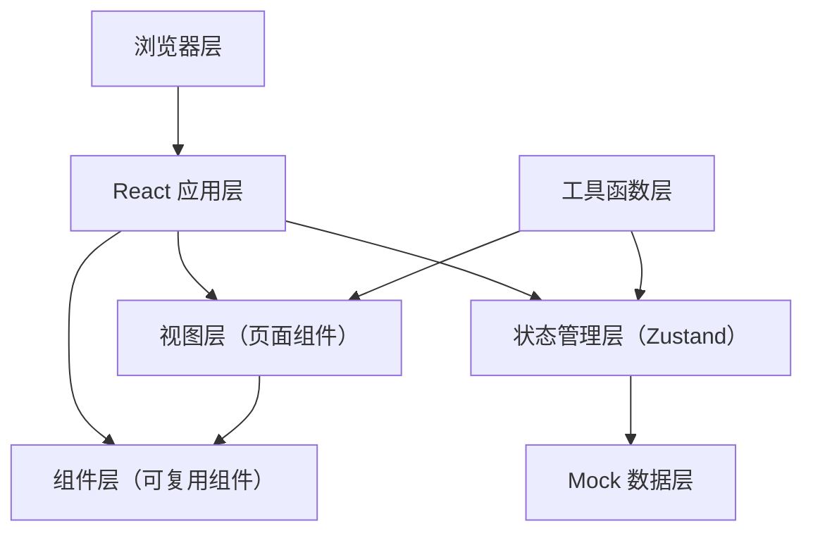

## 1. 架构设计

本项目为纯前端应用，采用 React + TypeScript + Vite 技术栈，使用 Tailwind CSS 进行样式开发，Zustand 进行状态管理。所有数据使用 Mock 数据模拟，无需后端服务。



## 2. 技术描述

- **前端框架**：React@18 + TypeScript
- **构建工具**：Vite@5
- **样式方案**：Tailwind CSS@3
- **状态管理**：Zustand
- **路由管理**：React Router DOM@6
- **图标库**：lucide-react
- **二维码生成**：qrcode.react
- **图表库**：recharts
- **日期处理**：date-fns

## 3. 目录结构

```
src/
├── components/        # 可复用组件
│   ├── Layout/        # 布局组件
│   ├── Calendar/      # 日历相关组件
│   ├── Form/          # 表单相关组件
│   ├── Order/         # 订单相关组件
│   ├── QRCode/        # 二维码组件
│   └── Admin/         # 管理员组件
├── pages/             # 页面组件
│   ├── CalendarPage.tsx
│   ├── BookingPage.tsx
│   ├── OrdersPage.tsx
│   ├── VerificationPage.tsx
│   ├── NoticePage.tsx
│   └── AdminPage.tsx
├── store/             # Zustand 状态管理
│   ├── useBookingStore.ts
│   ├── useUserStore.ts
│   └── useAdminStore.ts
├── data/              # Mock 数据
│   ├── venues.ts
│   ├── orders.ts
│   ├── notices.ts
│   └── admin.ts
├── utils/             # 工具函数
│   ├── date.ts
│   ├── price.ts
│   └── qrcode.ts
├── types/             # TypeScript 类型定义
│   └── index.ts
├── App.tsx
├── main.tsx
└── index.css
```

## 4. 路由定义

| 路由路径 | 页面名称 | 说明 |
|----------|----------|------|
| / | 场地日历 | 首页，展示场地日历和筛选功能 |
| /booking | 预约表单 | 预约场地表单页面 |
| /orders | 个人订单 | 用户订单列表 |
| /verification/:orderId | 入场核验 | 入场二维码展示 |
| /notice | 公告规则 | 公告和规则页面 |
| /admin | 管理面板 | 管理员后台 |

## 5. 数据模型

### 5.1 数据类型定义

```typescript
// 运动项目类型
type SportType = 'badminton' | 'tabletennis' | 'gym';

// 场地状态
type VenueStatus = 'available' | 'booked' | 'maintenance' | 'competition';

// 订单状态
type OrderStatus = 'pending' | 'completed' | 'cancelled' | 'no_show';

// 场地信息
interface Venue {
  id: string;
  name: string;
  type: SportType;
  capacity: number;
  pricePerHour: number;
  isFree: boolean;
}

// 时段信息
interface TimeSlot {
  id: string;
  startTime: string;
  endTime: string;
  venueId: string;
  date: string;
  status: VenueStatus;
  competitionName?: string;
}

// 订单信息
interface Order {
  id: string;
  orderNo: string;
  venueId: string;
  venueName: string;
  sportType: SportType;
  date: string;
  startTime: string;
  endTime: string;
  peopleCount: number;
  contactName: string;
  contactPhone: string;
  price: number;
  status: OrderStatus;
  createdAt: string;
  isVerified: boolean;
}

// 公告信息
interface Notice {
  id: string;
  title: string;
  content: string;
  type: 'announcement' | 'competition' | 'rule';
  date: string;
  isImportant: boolean;
}

// 管理员设置
interface AdminSettings {
  dailyBookingLimit: number;
  openTime: string;
  closeTime: string;
}

// 统计数据
interface Statistics {
  totalBookings: number;
  totalCheckIns: number;
  attendanceRate: number;
  noShowCount: number;
  dailyData: { date: string; bookings: number; checkIns: number }[];
}
```

### 5.2 状态管理

使用 Zustand 管理以下状态：
- **useBookingStore**：场地数据、时段数据、筛选条件、预约表单数据
- **useUserStore**：用户信息、订单列表、当前角色
- **useAdminStore**：管理员设置、统计数据、公告管理

## 6. 核心功能实现方案

### 6.1 日历视图
- 使用网格布局展示日期和时段
- 根据状态显示不同颜色背景
- 支持点击空闲时段直接跳转预约

### 6.2 预约表单
- 分步表单：项目选择 → 时段选择 → 信息填写
- 表单验证：必填项、手机号格式、人数限制
- 价格实时计算

### 6.3 订单管理
- 订单状态切换（待使用/已完成/已取消）
- 取消订单逻辑（未开始的订单可取消）
- 入场二维码生成

### 6.4 管理员功能
- 场地状态切换（空闲/维护）
- 发布赛事占用公告
- 每日预约上限设置
- 到场率统计图表
- 爽约标记功能

## 7. 开发规范

- 组件文件使用 `.tsx` 扩展名
- 每个组件保持单一职责，代码不超过 300 行
- 使用 TypeScript 类型安全
- 遵循 Tailwind CSS 类名约定
- 使用 lucide-react 图标库
- Mock 数据集中管理，便于后续接入真实 API
